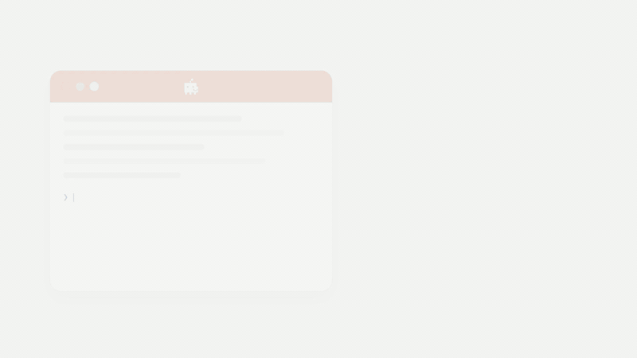

[](https://devin.ai)

# Devin Handoff

Hand off tasks to [Devin](https://devin.ai) from any coding agent or the command line.

Create a Devin session, get a URL, optionally poll until it's done, archive when finished.



```
┌──────────────┐     ┌──────────────────┐     ┌────────────┐
│  Your Agent  │     │  devin-handoff   │     │ Devin API  │
│  or CLI      │────▶│  skill + script  │────▶│  (REST)    │
└──────────────┘     └──────────────────┘     └────────────┘
                           │                       │
                           │ 1. Gather git context  │
                           │ 2. POST /sessions ───▶│
                           │◀─ session_id + url ────│
                           │ 3. Print URL           │
                           │ 4. (optional) Poll ───▶│
```

## Quick Start

### As an agent skill

Install it into your coding agent's skills folder so the agent can hand off
tasks to Devin on its own:

```bash
git clone https://github.com/club-cog/devin-handoff-skill.git

# Copy into your agent's skills directory — adjust the path for your agent
mkdir -p .your-agent/skills
cp -r devin-handoff-skill/ .your-agent/skills/devin-handoff/

# Set your API key (get one at https://app.devin.ai/settings/api-keys)
export DEVIN_API_KEY="your-key-here"
```

Then ask your agent to "hand this off to Devin." See [examples/](examples/)
for per-platform setup guides (Claude Code, Cursor, Windsurf, Codex).

For agents that use `AGENTS.md`, append the guide:

```bash
cat devin-handoff-skill/AGENTS.md >> your-repo/AGENTS.md
```

### From the command line

```bash
# 1. Set your API key
export DEVIN_API_KEY="your-key-here"  # Get one at https://app.devin.ai/settings/api-keys

# 2. Create a session from any git repo
./devin-handoff-skill/scripts/devin-handoff.sh create --task "Fix the flaky auth test in CI"
# → https://app.devin.ai/sessions/abc123

# 3. (Optional) Poll until it's done
./devin-handoff-skill/scripts/devin-handoff.sh poll devin-abc123 --interval 15
```

## How It Works

1. **Gathers git context** — repo slug, branch, uncommitted diff (truncated to 100KB)
2. **Creates a Devin session** — `POST /sessions` with your task + context
3. **Prints the session URL** — share it with the user
4. **(Optional) Polls** — `GET /sessions/{id}` every N seconds until Devin finishes

Devin gets its own VM with shell, browser, and full repo access. It clones the repo, checks out the branch, and starts working. All sessions are tagged with `handoff`.

## How Context Reaches the Cloud Session

Devin starts in a fresh VM, so the script packages up what your local agent
already knows and includes it in the session prompt:

- **Repo and branch** — detected from `git remote` and `git rev-parse`, so Devin
  clones the right repo and checks out the branch you're on
- **Uncommitted changes** — the output of `git diff HEAD` (truncated to 100KB)
  is included, so your work-in-progress carries over instead of being lost on
  the way to the cloud. If you have local edits you don't want sent, commit or
  stash them before creating the session.
- **`--context`** — whatever the calling agent has learned so far: files it
  examined, root-cause hypotheses, partial fixes

```bash
scripts/devin-handoff.sh create \
  --task "Fix the authentication timeout bug" \
  --context "Investigated src/auth/session.py and src/auth/middleware.py.
Timeout is hardcoded at 30m in session.py:42. Middleware doesn't check
the configured timeout, always uses the hardcoded value."
```

## Script Reference

```
Usage:
  devin-handoff.sh create --task TASK [OPTIONS]
  devin-handoff.sh poll SESSION_ID [OPTIONS]
  devin-handoff.sh archive SESSION_ID [OPTIONS]

Commands:
  create    Create a Devin session and print the session URL
  poll      Poll a session until it reaches a terminal state
  archive   Archive a completed session

create options:
  --task      Task description for Devin (required)
  --context   Additional context (files examined, findings, partial fixes)
  --tag       Extra tag (in addition to the default "handoff" tag)
  --api-url   Devin API base URL (default: https://api.devin.ai)
  --org-id    Organization ID (required for service keys)
  --user-id   Create session as this user (service keys only)

poll options:
  --interval  Polling interval in seconds (default: 30)
  --archive   Archive the session when it finishes
  --api-url   Devin API base URL (default: https://api.devin.ai)
  --org-id    Organization ID (required for service keys)

archive options:
  --api-url   Devin API base URL (default: https://api.devin.ai)
  --org-id    Organization ID (required for service keys)

Environment:
  DEVIN_API_KEY   Required. Personal (apk_*) or service (cog_*) key.
  DEVIN_ORG_ID    Optional. Organization ID for service keys.
  DEVIN_USER_ID   Optional. User ID for service keys.
  DEVIN_API_URL   Optional. Override the API base URL.
```

## API Key Types

- **Personal keys** (`apk_*`): Uses v1 API. Sessions appear in your sidebar.
- **Service keys** (`cog_*`): Uses v3 API. Requires `--org-id`. Use `--user-id` to make sessions appear in a specific user's sidebar.

## Requirements

- `curl` and `jq`
- `git` (optional — for automatic repo/branch/diff detection)
- A [Devin API key](https://app.devin.ai/settings/api-keys)

## License

MIT — see [LICENSE](LICENSE).
